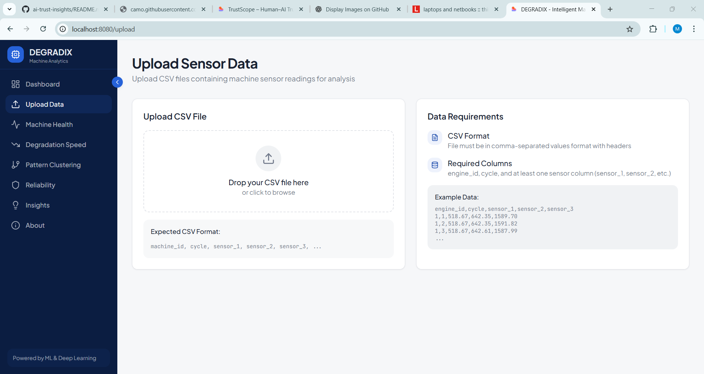
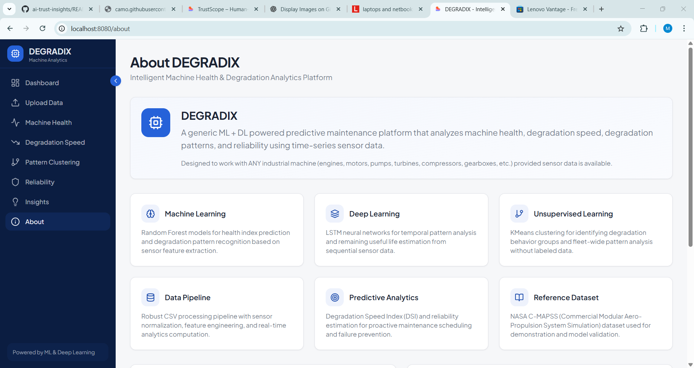
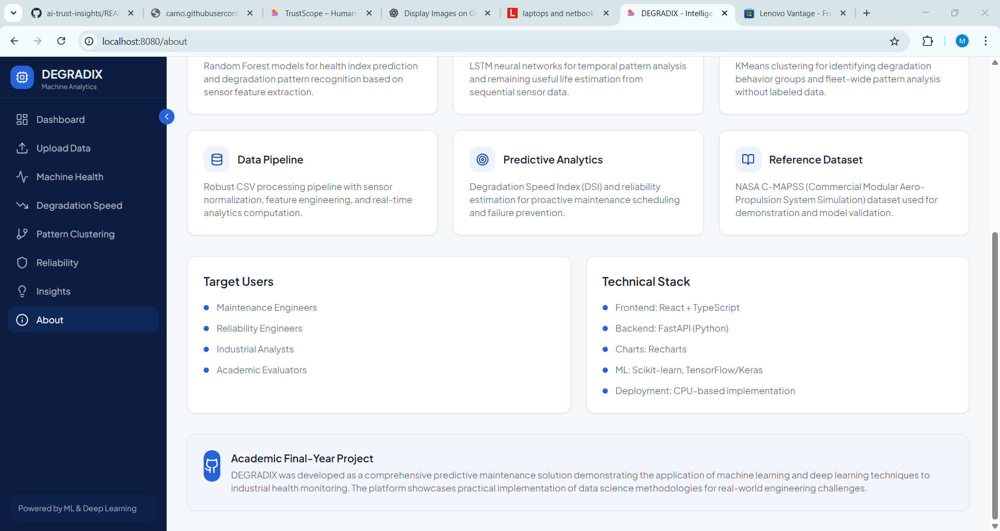
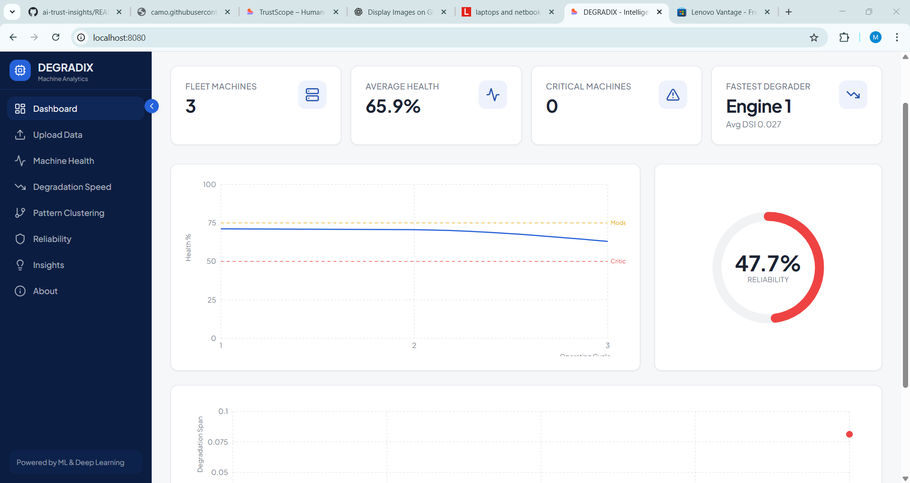
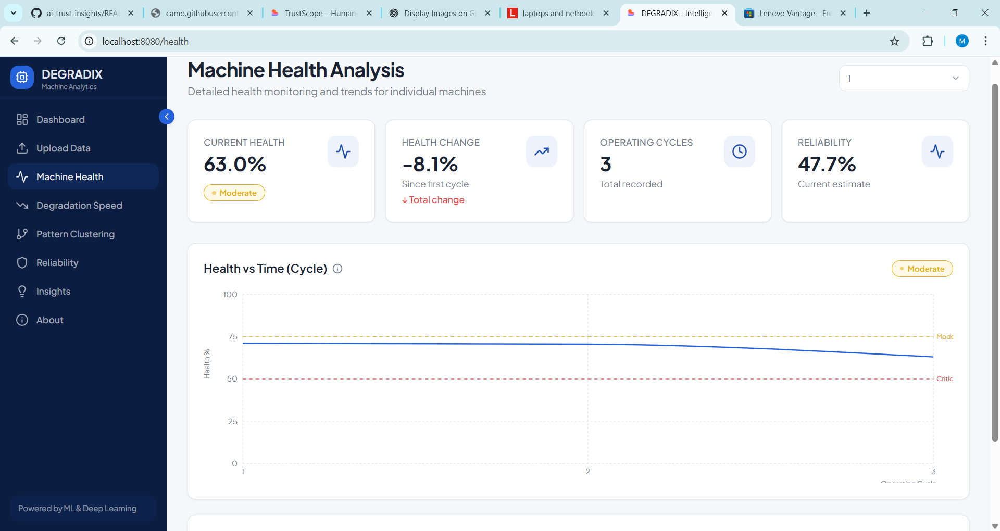
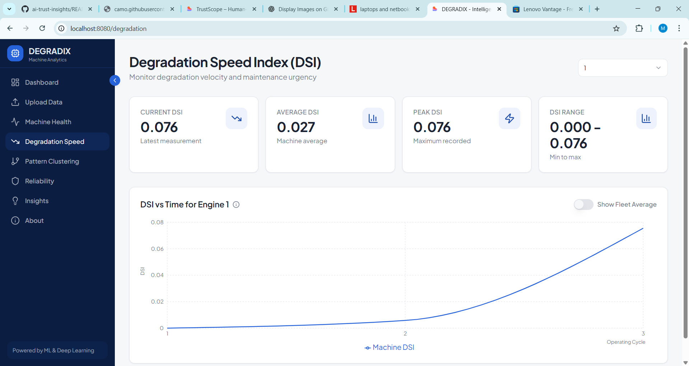
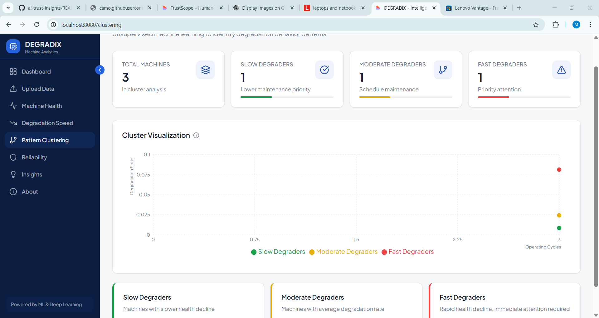
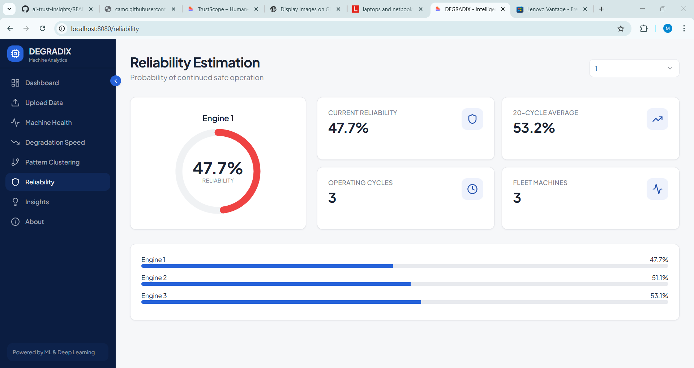

# 🚀 DEGRADIX – Predictive Machine Health Monitoring System

**DEGRADIX** is an advanced, end-to-end **machine health monitoring and degradation analysis system**. It leverages a **hybrid Machine Learning model** (Random Forest + LSTM) to estimate engine health, predict degradation speed, and cluster machines based on performance patterns.

Built with **FastAPI** (Backend) and **React + Vite** (Frontend).

---

## 📸 Screenshots

*Add your screenshots to an `images` folder in the root directory.*




### 📊 Dashboard
*Real-time fleet monitoring and health analytics.*






### 📩 Contact & Support
*Dedicated support channel for engineering queries.*


### 📤 Data Upload
*Seamless CSV upload for batch processing.*


### 💡 Insights & Clustering
*Deep dive into machine behavior and failure patterns.*

---

## 🔍 Key Features

- **Hybrid ML Analysis**: Combines Random Forest (for instant health mapping) and LSTM (for temporal degradation trends).
- **Health Index (0–1)**: Real-time estimation of engine condition.
- **Degradation Speed Index (DSI)**: Measures how fast a machine is deteriorating.
- **Reliability Forecasting**: Probabilistic reliability estimation based on current health.
- **Unsupervised Clustering**: K-Means clustering to group engines by degradation behavior (Fast, Moderate, Slow).
- **Interactive Dashboard**: Rich visualizations using Recharts and Tailwind CSS.
- **Direct Support**: Integrated contact form with direct email capability.

---

## 🛠️ Tech Stack

### Frontend
- **Framework**: React (Vite)
- **Language**: TypeScript
- **Styling**: Tailwind CSS, Shadcn UI
- **Routing**: React Router v6 (v7 ready)
- **State/Query**: TanStack Query

### Backend
- **Framework**: FastAPI
- **ML Libraries**: TensorFlow (Keras), Scikit-Learn, Pandas, NumPy
- **Server**: Uvicorn

---

## 🚀 Installation & Setup

### 1. Backend Setup
Navigate to the `backend` directory:
```bash
cd backend
# Create virtual environment (optional but recommended)
python -m venv venv
# Activate venv (Windows)
.\venv\Scripts\activate
# Install dependencies
pip install -r requirements.txt
# Run Server
uvicorn app:app --reload
```
*Backend runs on: `http://localhost:8000`*

### 2. Frontend Setup
Navigate to the root directory (or where `package.json` is):
```bash
# Install dependencies
npm install
# Run Development Server
npm run dev
```
*Frontend runs on: `http://localhost:8081` (or usually 5173)*

---

## 📞 Contact

**Lead Developer**: Mukul Mishra  
**Email**: [mukul362off@gmail.com](mailto:mukul362off@gmail.com)  
**Phone**: +91 6307704063

For any queries regarding the codebase or ML models, please reach out via the Contact page or direct email.
