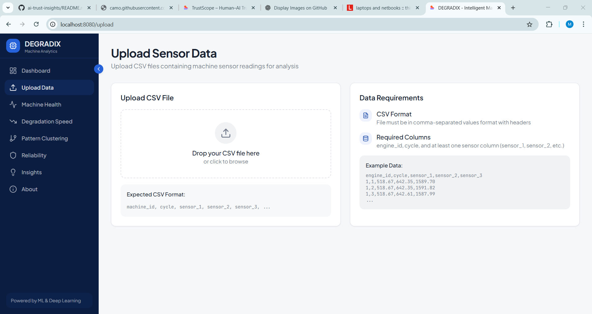
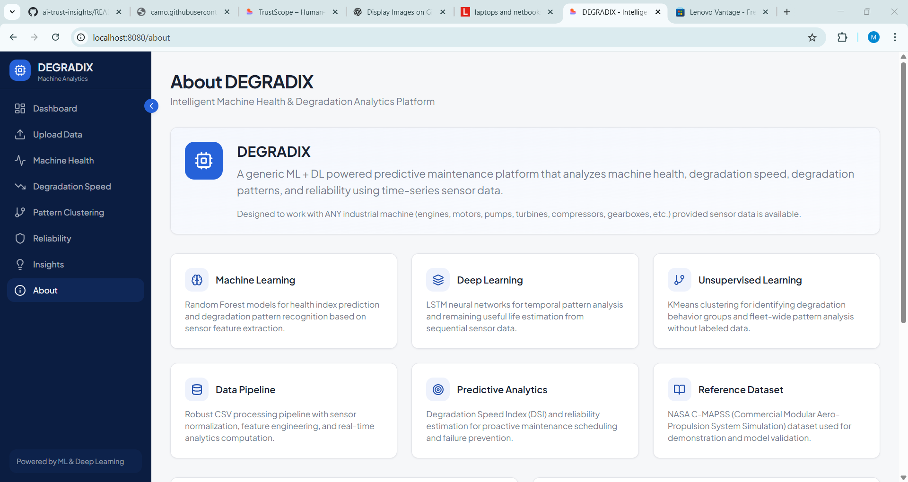
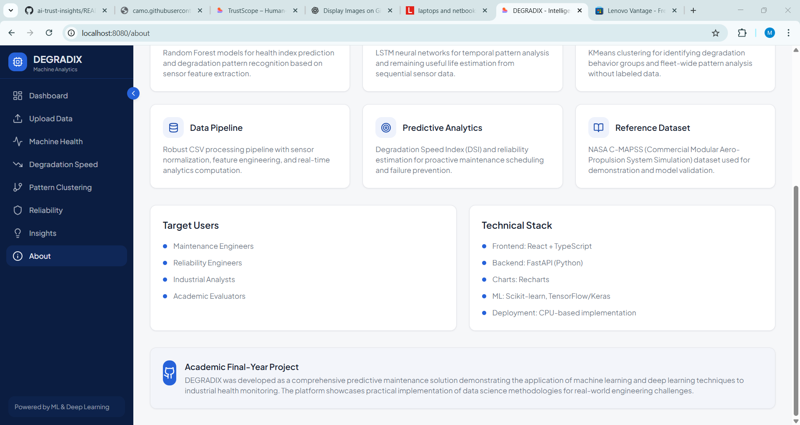

# 🚀 DEGRADIX – Predictive Maintenance & Machine Health Platform (V2)

**DEGRADIX V2** is an advanced, end-to-end **predictive maintenance (PdM) platform** built for CPU-only and lightweight edge environments. It monitors current engine health and forecasts the **Remaining Useful Life (RUL)** of machinery using a hybrid Machine Learning suite (Random Forest + LSTM) trained on historical degradation patterns.

Built with **FastAPI** (Backend) and **React + Vite** (Frontend).

---

## 📸 Screenshots

*Add your screenshots to an `images` folder in the root directory.*




---

## 🔍 Upgraded V2 Architecture

```mermaid
graph TD
    subgraph Frontend (React + TS)
        Dashboard[Dashboard Page]
        EvalPage[Model Evaluation Page]
        UploadPage[Upload Page]
      style Dashboard fill:#1f2937,stroke:#3b82f6,stroke-width:2px;
      style EvalPage fill:#1f2937,stroke:#10b981,stroke-width:2px;
    end

    subgraph Backend (FastAPI)
        API[app.py API Endpoints]
        Analytics[analytics.py Engine]
        DB[(SQLite DB / SQLAlchemy)]
      style API fill:#1e1b4b,stroke:#818cf8,stroke-width:2px;
      style DB fill:#1e1b4b,stroke:#a5b4fc,stroke-width:1px;
    end

    subgraph ML Suite
        Preprocess[preprocessing.py]
        RF_Health[rf_health.joblib]
        RF_Rul[rf_rul.joblib]
        LSTM_Rul[lstm_rul.keras]
      style RF_Health fill:#312e81,stroke:#6366f1,stroke-width:1px;
      style LSTM_Rul fill:#312e81,stroke:#4f46e5,stroke-width:2px;
    end

    UploadPage -->|Upload CSV| API
    API -->|Preprocess & Train| Preprocess
    API -->|Evaluate| Analytics
    Analytics -->|Predict Health Score| RF_Health
    Analytics -->|Predict RUL (single-cycle)| RF_Rul
    Analytics -->|Predict RUL (sequences)| LSTM_Rul
    API -->|Write Log| DB
    Dashboard -->|Query RUL & Health| API
    EvalPage -->|Fetch Metrics| API
```

### 1. Random Forest Models
- **rf_health.joblib**: Predicts the current **Health Score** (0–1 index) of a machine from its 21 sensor values. Indicates instant machinery state.
- **rf_rul.joblib**: Serves as a sequence-independent **Remaining Useful Life (RUL)** predictor. Used as a fallback when operational cycle history is less than 20.

### 2. LSTM Neural Network
- **lstm_rul.keras**: A sequence forecasting model (`LSTM(128) -> LSTM(64) -> Dense(32) -> Dense(1)`) trained to directly predict **RUL** based on rolling windows of size 20 across all 21 sensor channels. It captures temporal degradation trends for accurate long-term forecasting.

---

## 📊 Dataset & Definition of RUL

- **Dataset**: NASA C-MAPSS (turbofan engine degradation dataset, subset FD001). Contains operational cycles and 21 sensor channels simulating degradation under diverse operating regimes.
- **RUL Definition**: Remaining Useful Life is the number of operating cycles left before the engine reaches terminal failure.
  - **Formula**: `RUL = max_cycle - current_cycle` (Capped at 125 cycles to focus on late-stage degradation behavior).
  - **Health Score**: `Health = 1 - (current_cycle / max_cycle)`.

---

## 🛠️ Model Training Pipeline

The training pipeline loads NASA datasets, computes labels, scales sensors, trains estimators, and generates serialization artifacts.

To run the training script:
```bash
cd backend
# Make sure virtual environment is active
.\venv\Scripts\activate
# Start training
python train_models.py
```
This command outputs:
- `backend/ml/rf_health.joblib`: RandomForest model for health index.
- `backend/ml/rf_rul.joblib`: RandomForest fallback model for RUL.
- `backend/ml/scaler.joblib`: MinMaxScaler fitted on 21 sensor features.
- `backend/ml/lstm_rul.keras`: Keras LSTM model for sequence RUL forecasting.
- `backend/ml/metrics.json`: Performance scores (MAE, RMSE, R²).

---

## 🔌 API Documentation

All request parameters are standard CSV uploads or simple query calls.

### 1. Consolidated Analytics
- **Endpoint**: `POST /predict-complete`
- **Description**: Evaluates the latest operational cycle of the uploaded machinery file, saves details to database logs, and returns consolidated diagnostics.
- **Response Format**:
```json
{
  "health_score": 0.8423,
  "predicted_rul": 76,
  "risk_level": "MEDIUM",
  "reliability": 87.5,
  "cluster": 1
}
```

### 2. Temporal RUL Series
- **Endpoint**: `POST /predict-rul`
- **Description**: Returns RUL predictions for all operating cycles in the uploaded file (uses LSTM if sequence length >= 20, else RF fallback).
- **Response Format**:
```json
[
  { "engine_id": 1, "cycle": 1, "predicted_rul": 125 },
  { "engine_id": 1, "cycle": 21, "predicted_rul": 118 }
]
```

### 3. Health Series
- **Endpoint**: `POST /predict-health`
- **Description**: Returns predicted health indices for all operating cycles.
- **Response Format**:
```json
[
  { "engine_id": 1, "cycle": 1, "health": 1.0 },
  { "engine_id": 1, "cycle": 21, "health": 0.892 }
]
```

### 4. Metrics Retrieval
- **Endpoint**: `GET /metrics`
- **Description**: Fetches training evaluation scores (MAE, RMSE, R²) for all ML models.

---

## 📞 Contact

**Lead Developer**: Mukul Mishra  
**Email**: [mukul362off@gmail.com](mailto:mukul362off@gmail.com)  
**Phone**: +91 6307704063
